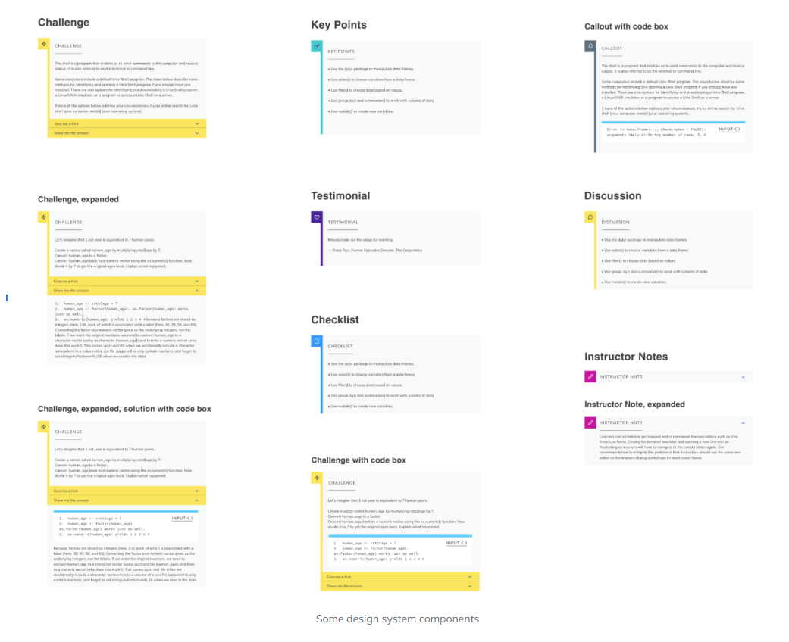

Computational social science (CSS) brings computational approaches to social science questions. [Nextflow](https://www.nextflow.io/) is a workflow management software which enables the writing of scalable and reproducible scientific workflows. With this half day workshop we will motivate the use of this tool in operationalising reproducible social science research.

This is a student led introductory lesson to computational workflows. No previous knowledge of Nextflow, or other workflow software is required.

::::::::::::::::::::::::::::::::::::::::::  prereq

### Checklist

- [ ] Bring own device to follow practical component
- [ ] Set up an account with GitHub
- [ ] Optionally, upgrade to a GitHub Education account

::::::::::::::::::::::::::::::::::::::::::::::::::

::::::::::::::::::::::::::::::::::::::::::  discussion

### Optional 

It is helpful to be familiar with using a programming language, to the level of [Plotting and Programming in Python](https://swcarpentry.github.io/python-novice-gapminder) or
[R for Reproducible Scientific Analysis](https://swcarpentry.github.io/r-novice-gapminder), although this lesson does not specifically rely on Python or R. A full set of recommended courses and resources you can explore is covered in [Software Carpentry Lessons](https://software-carpentry.org/lessons/). 

::::::::::::::::::::::::::::::::::::::::::::::::::

The workshop offers an overview to Nextflow. Nextflow integrates various software package and environment management systems such as Docker, Singularity, and Conda. It allows for existing pipelines written in common scripting languages, such as R and Python, to be seamlessly coupled together. It simplifies the implementation and running of workflows on cloud or high-performance computing (HPC) infrastructure. 

#### Explore the Material

::::::::::::::::::::::::::::::::::::::::::  discussion

---
| Section | Duration | Topics Covered |
|---------|----------|---------------|
| **1. Introduction** | 00h 25m | What are the FAIR research principles? How do FAIR principles apply to software? How does folder organisation help me? |
| **2. Hello Nextflow** | 00h 50m | What is Nextflow? Why should I use a workflow management system? What are the features of Nextflow? What are the main components of a Nextflow script? How do I run a Nextflow script? |
| **3. Parameters** | 01h 15m | How can I change the data a workflow uses? How can I parameterise a workflow? How can I add my parameters to a file? |
| **4. Channels** | 01h 40m | How do I move data around in Nextflow? How do I handle different types of input, e.g. files and parameters? How can I use pattern matching to select input files? |
| **5. Modules** | 02h 10m | How do I run tasks/modules in Nextflow? How do I get data, files and values, into a module? |
| **6. Modules Part 2** | 02h 10m | How do I get data, files, and values, out of processes? How do I handle grouped input and output? How can I control when a process is implemented? How do I control resources, such as number of CPUs and memory, available to processes? How do I save output/results from a process? |
| **7. Workflow** | 02h 10m | How do I connect channels and processes to create a workflow? How do I invoke a process inside a workflow? |
| **8. Operators** | 02h 10m | How do I perform operations, such as filtering, on channels? What are the different kinds of operations I can perform on channels? How do I combine operations? How can I use a CSV file to process data into a Channel? |
| **9. Reporting** | 02h 10m | How do I get information about my pipeline run? How can I see what commands I ran? How can I create a report from my run? |
| **10. Nextflow configuration** | 02h 10m | How do I configure a Nextflow workflow? How do I assign different resources to different processes? How do I separate and provide configuration for different computational systems? |
| **11. Auxiliary Tools** | 02h 10m | When should I use a pre-built container? How can I customise a container? What is a remote codespace? |
| **12. Resuming a Workflow** | 02h 10m | How can I restart a Nextflow workflow after an error? How can I add new data to a workflow without starting from the beginning? Where can I find intermediate data and results? |
| **13. Portability of Workflow** | 02h 10m | How can I move my analysis to a computer cluster? |
| **Finish** | 02h 10m |  |

::::::::::::::::::::::::::::::::::::::::::::::::::
